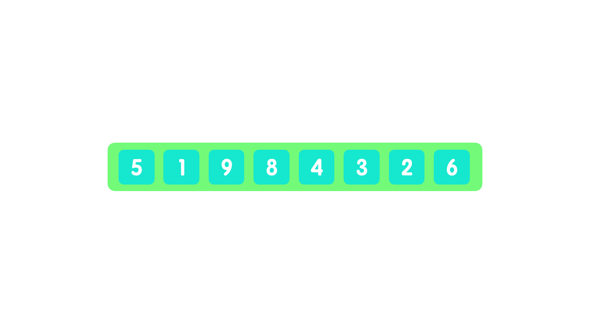

# 快速排序

### 概念

`快速排序` 是一种基于分治策略的排序算法，运行很高效，应用非常广泛。它最主要的操作

核心在于 `"哨兵分划"`，简单来说每一次的排序都会挑一个 `"哨兵"` ,然后将小于他的元素

全部划分到他的左边，将大于他的元素划分在他的右边。第一次划分后生成了两个小数组，

分别在他的左边和右边，简单称呼就是 `左子数组` 和 `右子数组`,然后再分别对他们重复上

面的流程（递归），直到最后将分的很少的元素都排好～ 


### 特性

- **平均性能好：** 在大多数情况下，它的性能表现非常优秀。对于大规模数据集，快速排

  序通常比其他常见的排序算法（如冒泡排序、插入排序等）更快。

  

- **分治策略：** 快速排序采用分治的策略，将原问题划分为多个小问题，分别解决这些小

  问题，最后将结果合并。这种策略使得快速排序适用于并行处理，因为可以同时处理不

  同部分的数据。

  

- **原地排序：** 快速排序是一种原地排序算法，不需要额外的空间来存储临时数据，因此

  在空间复杂度上具有优势。这对于大规模数据集而言是一个重要的考虑因素，尤其是当

  内存空间有限时，这也是为什么很多语言的 `Sort` 方法都是封装快速排序的


### 流程

- **选择基准元素（哨兵）：** 一般选择数组中最后一个元素作为基准（pivot）

  

- **划分操作：** 写一个函数（partition）用于划分。将数组中小于基准元素的元素移到

  基准元素的左边，将大于基准元素的元素移到基准元素的右边

  

- **递归调用：**分别左子数组、右子数组进行递归快速排序

  

- **合并结果**


#### 动画示例





#### 代码

```js
// 快速排序函数
const quickSort = function (arr, left = 0, right = arr.length - 1) {
  if (left < right) {

    // 获取基准元素的索引
    let middle = partition(arr, left, right);

    // 分别左子数组、右子数组进行递归快速排序
    quickSort(arr, left, middle - 1);
    quickSort(arr, middle + 1, right);
  }
  return arr;
};

// 划分操作函数，返回基准元素的索引
const partition = function (arr, left, right) {
  
  // 选择右侧元素作为基准
  let pivot = arr[right];
  let i = left;

  // 遍历数组，将小于基准的元素移到左侧
  for (let j = left; j < right; j++) {
    if (arr[j] < pivot) {
      swap(arr, i, j);
      i++;
    }
  }

  // 将基准元素放到正确的位置上
  swap(arr, i, right);

  // 返回基准元素的索引
  return i;

};

// 交换元素函数
const swap = function (arr, i, j) {
  let temp = arr[i];
  arr[i] = arr[j];
  arr[j] = temp;
};
```


